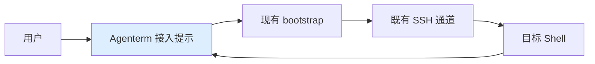

# Feature：嵌套 SSH 会话的 Warpify 接入

**作者**：Codex
**日期**：2026-09-11
**状态**：Approved（用户 go 批准；实现与实际验收尚未完成）

本次修订替代未批准的 tx-jump 兼容草稿；当前范围以已批准的 219 接入计划为准。

---

## 1. 需求背景

### 1.1 问题与场景

用户通过 Agenterm 的 `ssh 219` 经公司跳板机进入目标运维机。普通终端登录可用，但连接完成后没有自动获得 Warpify 的命令块和终端集成；在该连接方式下，用户需要反复手工执行接入命令，才能使用集成能力。

2026-09-11 的用户测试确认：手动接入后，`pwd` 与 `ls` 的 Tab 目录补全正常；目录标签的本机 HOME 展开错误修复后，00:39（Asia/Shanghai）复测对应的进程日志也不再出现对应目录查询失败。这说明已有目标会话可以完成基本集成，当前痛点是登录完成到集成可用之间仍需要人工粘贴，而不是基本远端补全不可用。

这条连接包含两层登录。中间跳板的欢迎信息、最终目标的 Shell 提示和认证交互出现在同一个终端中，错误地把中间阶段当作目标登录完成，会让接入操作落到错误位置。用户要求在保留公司认证与普通 SSH 可用性的前提下，减少重复接入操作。

### 1.2 现状分析

已核对原版 checkout c12e213 与 Agenterm：SSH wrapper、Warpify 模块和 bootstrap 脚本一致。配置 RemoteCommand 时 wrapper 退回普通 SSH；普通 SSH 的登录检测仍有代码入口，但 Ready 处理只显示旧 tmux 弃用通知，不调用接入，也不提供接入提示。现有运行日志未记录 Ready 的实际发送，不能把静态路径当成这次运行的事件证据。

登录检测是输出启发式：欢迎信息、提示符或延迟复查后的其他输出都可能触发；它不是最终目标身份的证明。现有手动接入会注册新会话并启动真实 bootstrap，已验证基本功能可用。

## 2. 目标与非目标

### 2.1 目标

让现有嵌套 SSH 用户无需粘贴控制序列即可主动接入，保持命令块、目录和补全可用。安全优先于自动化：无法确认最终目标时，不自动执行接入。

### 2.2 非目标

本阶段不实现无人确认的自动注入，不宣称自动接入目标完成；不支持受限 tx-jump 自身的集成，不扩展到任意 RemoteCommand 自动化，也不恢复远端服务组件。

## 3. 需求

### 3.1 功能性需求

在普通 SSH 仍运行且终端呈现可识别 Shell 提示时，提供主动接入入口。提示本身不向远端写入字节；用户确认已进入目标 Shell 后触发。拒绝过期入口、已接入会话和重复点击；认证中、命令退出或切换后不执行旧接入动作。保留原有非 SSH 子 Shell 接入行为。

### 3.2 非功能性需求

接入不增加阻塞等待或终端锁重入；诊断不记录密码、命令输出和完整启动脚本。失败可继续使用普通 SSH，不自动重复尝试。

### 3.3 约束

保留公司认证、现有 SSH 配置与远端 RC 文件；不绕过跳板机命令策略、不向中间跳板自动注入、不使用 Computer Use。通过用户操作 GUI 与本地日志验收。

## 4. 设计方案

### 4.1 方案总览

恢复原版遗留检测与现有客户端接入入口之间的连接。当前阶段只提示，由用户确认目标；复用既有启动与失败处理，不创建新远端协议。

### 4.2 前提与系统不变量

用户手动接入和目标 Bash 可用是已验证事实；提示文本不能认证最终主机。新增入口不提高远端输出的信任等级，发起接入仍需用户主动确认当前终端位置。

### 4.3 接口与协议

客户端提示明确说明“确认已进入目标 Shell 后接入”。兼容现有 Block 横幅与 Warpify footer，沿用接入操作及快捷键；SSH 的“不再提示”按主机黑名单处理。不新增 SSH 配置和远端协议。过期或不安全状态下点击不执行，并提供可诊断的拒绝原因；不会自动记忆为无人确认接入。

### 4.4 组件设计

终端模型保留命令与输出状态并发出登录候选通知；视图验证当前 SSH 状态，管理提示生命周期；现有 bootstrap 负责实际接入。提示状态属于当前终端，不跨窗口或会话共享。

### 4.5 关键机制

候选只能显示提示，不能写 PTY。显示和点击均核对当前活动 Block、会话、SSH 主机黑名单、禁用设置、非 Agent/共享查看者状态及尚未启动集成。

不能仅凭历史 Last login 显示提示：需要最后一行匹配 Shell 提示且不属于已知认证提示。Last login 先到而最终提示后到时应继续观察，不因一次过早 Ready 永久停止提示机会。该条件只负责展示和点击时的防误触，最终目标由用户确认，不能据此启用无人值守接入。

提示绑定源 Block 与会话；点击在同一同步处理内重新检查并消费资格，再调用现有 bootstrap。退出、取消、源 Block 变化或接入开始使资格失效；旧提示不会转用于新 Shell。普通子 Shell 的原有操作保持原行为。实际成功以远端 bootstrap 完成事件为准，不合成成功事件。

终端模型锁只用于读取快照或短状态更新，调用 UI 与 bootstrap 前释放；异步通知不能将旧 Block 的资格转移到当前 Block。同一 SSH 命令仍存活时，过早候选不消费后续观察资格。

## 5. 备选方案

直接在 Ready 后自动 bootstrap 改动最小，但公司认证文本和中间登录可能误判，因此不采用。修改 RemoteCommand 让目标启动时主动接入可提供更确定的时机，但改变用户连接配置，不符合本阶段边界；只有另行批准后才考虑。继续手贴命令不改变代码，但不能消除已确认的使用负担。

## 6. 横切关注点

### 6.1 兼容性、升级与回滚

本地开发构建先验证 219；保持两种现有提示呈现方式可用。没有远端持久化变更，回退客户端即可撤销新增入口。

### 6.2 故障处理与恢复

沿用 bootstrap 超时与失败显示；不主动关闭 SSH，不自动重试。重启后用户重新登录，不恢复未消费的接入资格。

### 6.3 并发与一致性

N/A：本次不增加共享持久状态或跨进程一致性协议；终端内资格与锁约束见 §4.5。

### 6.4 性能与资源模型

复用现有输出检查和事件循环，不新增轮询任务。无性能承诺；避免为每批输出重复追加提示或日志。

### 6.5 可观测性与运维

日志需能区分“未开启检测”“候选未到”“提示被保护条件拒绝”“用户发起”“实际成功/失败”，覆盖检测开始、候选结果、视图接收与显示/拒绝。保留会话和 Block 关联，不输出认证内容。

### 6.6 安全性

远端可伪造提示文本，因此主动确认不能被替换为自动授权。提示展示不发送探测或控制序列；不修改跳板策略或执行受禁工具的替代方案。

## 7. 测试计划

单元覆盖 SSH 识别与提示判定，包含 authz、Last login、Pin+Token、最后提示分批到达和普通输出；状态测试覆盖过期通知、重复点击、禁用/黑名单、认证中、Agent/共享查看者、已接入及退出恢复。通过 PTY 写入 spy/mock 或等价定向测试验证仅展示提示时零新增写入。复用现有非 SSH 子 Shell 回归。构建后由用户真实登录 219，确认入口、点击、pwd、Tab 和退出；日志关联点击与真实 bootstrap 完成。

## 8. 未决问题与风险

无人确认自动接入尚无足以区分嵌套登录阶段的证据，保持未完成；继续需要实际登录阶段证据或另行批准的目标协作配置。

用户可能在错误目标 Shell 上主动点击。Detection：界面明确当前待接入命令，运行日志关联来源。Mitigation：清晰确认文案、遵守黑名单、用户取消；不把一次点击变成后续自动授权。

Shell 提示无法匹配时可能不展示入口。Detection：记录拒绝原因，保留普通终端可用。Mitigation：保留已验证的手动接入路径，按实际提示补充测试，不放宽为任意输出自动执行。

## 9. 参考资料

- 本仓库 app/src/terminal/ssh/util.rs：SSH 命令解析与登录输出分类。
- 本仓库 app/src/terminal/model/terminal_model.rs：登录检测生命周期。
- 本仓库 app/src/terminal/view.rs：AfterBlockStarted、Ready 分支、现有接入与提示动作。
- 本仓库 app/assets/bundled/bootstrap/zsh_body.sh：RemoteCommand 回退。
- 本地原版 /Users/nickhaoxu/my-stdio/warp，checkout c12e213，已对照上述接入路径。
- HANDOFF.md 与 2026-09-11 00:39（Asia/Shanghai）Agenterm 本地测试日志：目录标签修复与手动接入验收。
