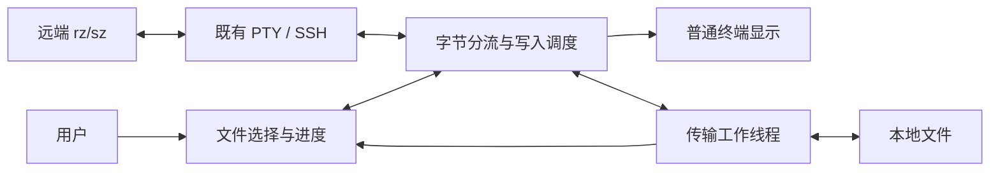

# Feature：ZMODEM 文件传输与 WeTERM 功能对齐

**作者**：Codex，与项目维护者协作
**日期**：2026-09-12
**状态**：Approved for implementation under delegated authorization; independent review PASS

用户于 2026-09-12 授权跳过常规确认，继续至完成功能；保留独立设计和代码评审。

## 1. 需求背景

### 1.1 问题与场景

用户希望在 Agenterm 中，像使用 WeTERM 一样，在当前远端终端执行 `rz` 上传本地文件，
执行 `sz` 下载远端文件。使用场景包括普通 SSH，以及先登录跳板机、再交互式登录目标机器的
多跳 SSH；文件传输应发生在用户当前操作的目标会话，不要求另建文件传输连接。

用户反馈，此前尝试加入 ZMODEM 后反复遇到问题，尚未形成可稳定依赖的完整体验。现有分支
已经具备部分双向传输能力，但“某个文件传成功”仍不能代表整个使用流程可用：选择文件或目录、
批量传输、显示结果、取消操作，以及失败后继续使用终端，都是用户完成一次传输的一部分。

2026-09-12 的源码调查确认，当前实现仍有取消未通知对端、下载目录在传输后才选择、上传进度
缺失等行为问题；同时发现多个终端同时传输时文件可能混淆、慢磁盘或大文件可能影响界面响应的
代码风险。这些风险关系到文件正确性和现有终端是否可继续使用，不能只按显示问题处理。
这些调查结果不等同于已复现用户此前每次故障，其具体原因仍需单独验证。

现有协议层测试已通过，但本次调查尚无覆盖完整 GUI 使用流程和多跳 SSH 的验收证据。
这使得用户即使看到部分测试成功，仍无法据此判断日常传输是否可靠。证据及其适用边界见
[接手调查](../../../../.agent/zmodem-rzsz/investigation.md)。

### 1.2 现状分析

已验证基线为 594 项终端测试通过、2 项跳过，包含 39 项协议单测和 5 项真实 lrzsz 互通测试。
这些互通测试没有覆盖实际应用中的字节分流、文件选择和保存，也没有完整要求对端正常退出。
当前下载数据在传输完成后才保存，取消选择不会通知对端；上传进度尚未完整呈现。
源码调查还发现并发终端数据归属、有界资源使用、静默超时和终端状态恢复方面的风险。
上述均有接手调查记录，不将它们冒充对用户历史故障的现场复现。

WeTERM 主仓库文档和本机 3.5.7 发布代码提供行为参照。核心子模块不可访问，因此参照的版本
与仓库锁定提交不同。其已核实能力包括目录选择、重名策略、多文件、取消、拖拽和可选跨终端转发。

## 2. 目标与非目标

### 2.1 目标

首要交付 macOS GUI 中可靠的双向 rz/sz；优先保证文件正确、结果真实和终端可恢复，再完成
与 WeTERM 对齐的目录、批量、拖拽和可选跨终端转发体验。传输成功需要本地文件内容一致、
对端正常结束及终端仍可使用的证据，不能只由本地进度显示判定。

### 2.2 非目标

不提供目录递归、会话中断后的续传、X/YMODEM 或 SSH bootstrap 修复。不重做 SFTP 或 Drive。
本期不宣称 Windows/Linux/TUI 完整体验已验收，不复刻 WeTERM 外观。协议内错误重传不属于
“会话中断后续传”的排除范围。

## 3. 需求

### 3.1 功能性需求

远端 rz 自动请求一次本地多选；重复握手不能重复弹窗。远端 sz 接收前选择目录，整批只选择一次。
可使用固定目录，并记住实际选择的目录。提供跳过、自动重命名和用户明确选择的覆盖策略。
零字节、二进制、中文/空格文件名及多文件均需支持；单文件超过 u32::MAX 时明确拒绝，不能静默跳过。

文件菜单提供上传与取消入口；配置支持 ZMODEM 开关、下载目录/每次询问、重名策略、拖拽传输模式
和上传命令。拖拽开启后只向用户当前选定终端发送命令，默认命令为 `rz`，不默认强制覆盖远端文件。
与既有拖入路径/SFTP 行为通过显式模式区分；未知是否处于 shell 提示符时，必须由用户显式发起上传。

每个文件显示方向、名称、字节数和成功/跳过/失败结果；传输中提供取消按钮及 Ctrl-C。
取消选择、远端中止、静默超时、磁盘失败、断连、关闭终端均须结束传输，不能报告成功。
传输结束后的普通输出必须继续显示，不能丢失同批到达的提示符。正常输出的尾部星号不应永久消失。

多个终端可独立传输；切换焦点或旧选择窗口返回不能改变传输目标。跨终端转发默认关闭，启用后
明确选择目的终端；结果以目的端接收成功为准，任一侧取消/失败应结束关联操作，不影响第三个终端。

### 3.2 非功能性需求

文件内容正确优先于吞吐；未完成文件不得以成功文件的名称暴露，默认不能覆盖用户已有文件。
不对突然断电后的存储硬件行为作超出操作系统同步语义的承诺。
大文件传输内存不能随文件尺寸线性增长，协议数据队列总预算每终端不超过 1 MiB。
用户取消须在正常调度条件下 1 秒内停止产生新数据；已经阻塞的 OS 文件操作不保证可被强行中断。
对端静默 30 秒应失败，重复无有效进展的控制帧不能无限延长截止时间。等待选择可持续 120 秒。
普通非协议前缀最多滞留 100 ms；进度更新最多每 100 ms 一次，重要终态不受节流影响。
这些是本次自主推进选择的验收预算，不是已测性能；实施验证不达标时必须记录并调整方案。

### 3.3 约束

兼容标准 ZMODEM 和本机 lrzsz 对端；使用当前 SSH 字节通道，不要求 SFTP、ProxyJump、转发权限
或远端 Agenterm 组件。保留 Rust/WarpUI 运行时，不新增 Node 或外部传输可执行程序作为运行依赖。
沿用本机用户权限，不触碰生产机器、远端 RC 或认证配置。新增运行时依赖、范围变化和生产验证需另行确认。

## 4. 设计方案

### 4.1 方案总览

将原有接管方向保留，重新建立字节归属与完成确认。GUI 不携带文件内容，协议和磁盘操作在独立
传输工作线程上进行；原 PTY event loop 继续拥有实际终端读写和 ANSI 解析。

### 4.2 前提与系统不变量

现有 PTY 是单一字节读写权威；用户界面通过既有消息管道与它通信，这是源码已验证的事实。
每个终端同时最多一个活动传输，各传输具有独立标识；事件、选择回调和取消请求都必须匹配标识。
文件成功意味着收到完整文件并完成本地写入/发布，整批成功还要求协议正常结束。
跨终端转发的源端完成不是目的端成功。普通输出和协议数据只允许各消费一次。
通道需要能传送协议所需八位数据；无法修复的通道转换必须明确失败，不误称成功。

### 4.3 接口与协议

对外保持标准 rz/sz wire 格式，支持 CRC16/CRC32、必要转义、重发与规范取消序列。
上传被对端 ZSKIP 拒绝时显示“跳过”，不伪装已上传。下载覆盖仅由本地用户策略决定，不服从远端
文件管理标志而擅自覆盖。非法名称拒绝，不将远端路径解释为本地目录。

新增设置只在 GUI、本地设备存储；开关有相应命令面板动作。关闭 ZMODEM 后不探测、不修改普通字节。
不支持的网络后端或无选择 UI 的 surface 默认不启用。显式入口需要可用的本地 PTY。
暂存式跨终端转发会使用本地临时磁盘空间，UI 显示接收与转发两个阶段，不宣称零落盘直通。

### 4.4 组件设计

PTY 分流器拥有探测候选、活动标识、有界输入和输出队列，以及 timer 调度；不读写业务文件。
传输 worker 独占协议状态和文件句柄，以有界数据块进行磁盘 I/O，按协议动作顺序生成事件。
GUI 按终端管理选择和进度，仅接收元数据；不再使用应用级 pending 文件内容缓冲。
设置模型只保存用户偏好。跨终端协调器保存两端绑定和私有临时目录，调用同一传输接口，不绕过 PTY。

内部请求区分启用、选择上传、选择下载和取消；事件区分选择请求、进度、文件结果和传输终态。
均携带传输标识，方向与结果是明确枚举。磁盘内容不走 GUI 事件队列。

### 4.5 关键机制

#### 4.5.1 探测、状态与字节边界

只完整合法的起始帧触发接管；非起始帧和过期候选原样返回显示。状态依次为普通、等待用户选择、
传输、结束排空、普通。等待选择已经占有传输，重复握手不会新建请求。结束必须保留 consumed
之后的字节，处理标准 ZFIN/OO 后把普通尾部交回显示。异常结束只抑制可识别协议残留，并设置
有界退出时间，不能无限吞掉普通输出。

#### 4.5.2 背压、timer 与取消

PTY 与 worker 的字节队列均有固定容量；队列满时暂停继续读，保留未投递字节，不能丢弃。
worker 输出也必须服从 PTY 实际写入排空，不能把有界通道转移成无界 write_list。
PTY poll 使用传输和普通 ANSI deadline 的最小值；worker 工作返回能够唤醒或由活动期短周期调度拾取。
普通输入在传输中不混入协议；Ctrl-C 变为取消，取消标志不排在大量文件数据之后。
取消清除本传输待发数据，优先发送规范 CAN 序列；worker 不在 GUI/PTY 线程上同步 join 等待磁盘。

#### 4.5.3 文件生命周期

目标目录先确认，再接受文件。名称限定为单一正常文件名，拒绝路径分隔、绝对路径、点目录及
终端控制字符。在目标目录创建独占临时文件，分块写入；持久化确认后才推进相应协议动作。
文件完成时核实尺寸、同步文件，按策略原子发布；非覆盖策略用原子 no-clobber 处理竞争。
取消与发布通过独立的短临界区裁决：提交尚未开始时取消胜出，禁止发布；提交已开始时先确定
发布结果，再结束会话，已成功发布的文件不能撤回或标为未写入。该临界区不持 UI/PTY 模型锁，
取消请求本身不等待磁盘。文件完成确认必须在本地提交成功后才允许发送；提交失败发中止。
覆盖只替换目录项，不跟随目标符号链接；临时文件随取消/失败清理。进度只计算已确认的有效位置，
重传不重复累计。上传保留文件句柄并 seek 分块读取，源长度变化或提前 EOF 明确失败。

#### 4.5.4 原生协议与 termios

使用现有 zmodem2 作为 native 协议核心，去掉“整文件预读”的错误适配。
兼容问题用真实对端测试定位；若需修复 ZFILE、结束尾部或 ZSKIP 结果，采取带许可证的局部
vendor 补丁并保留独立回归，不在生产调用点偷偷替换输出帧。
不全局改 raw/cooked。协议正确转义控制字符；若实测证明需临时更改 termios，只保存/恢复本传输
改动的原始标志，并覆盖成功、取消、错误和关闭路径。不能结束时无条件打开 IXON/IXOFF。

#### 4.5.5 跨终端转发

首版使用私有临时目录逐批暂存，源端完整写入后，才向已绑定的目的终端执行用户配置的 rz 并上传。
这样复用同一文件正确性/重传逻辑，代价是额外磁盘空间和分阶段延迟。临时目录只属于这对传输，
失败、取消和正常结束均清理；进程崩溃残留留在 OS 临时目录，不误作为用户下载发布。
选择时排除自身和忙碌/已关闭终端；选择后再次校验目的终端的存活及空闲状态。目的端在整个
准备期被预留，其他上传不能抢占。任何异步返回必须校验绑定，目的关闭即取消源端并清理。
目的端预留期间阻止普通输入且保留取消通道；真正发命令前重新校验终端身份及 shell 就绪状态。
若不能可靠确认仍在原 shell，转为等待目的端用户显式执行 rz，绝不自动向未知前台程序写入命令。

## 5. 备选方案

保留现有适配器逐项补丁，改动较小，但整文件内存、错误事件顺序和缺少异步完成契约使每个修复
牵连其他路径，因此不选。重构适配边界并复用 native 核心能保留协议资产且避免引入新运行时。

直接嵌入 zmodem.js 更接近 WeTERM，但需 JS 引擎/运行时、跨语言 I/O 和打包维护；只有 native
核心经互通测试证明确实不适用时再考虑。捆绑 lrzsz 可利用成熟协议实现，但引入进程生命周期、
平台分发和许可证成本，本轮不选择。

跨终端直接流式转发延迟低且不占整文件磁盘，但目的端重传偏移需要可回读数据以及双端背压联动。
暂存方案牺牲延迟、增加临时磁盘，换取可复用的重试和校验；当用户明确要求零落盘或低首字节延迟时重新评估。

## 6. 横切关注点

### 6.1 兼容性、升级与回滚

新路径先建立再切换调用方，避免中间状态删除可用实现。只新增本地设置，不修改持久化数据库。
新旧客户端通过标准 ZMODEM 与远端互通，不要求远端同步升级。回退到旧构建时新设置被忽略，
已发布文件保持普通文件；出现数据差异、普通终端丢字节或无法取消即停止发布并关闭特性。

### 6.2 故障处理与恢复

worker panic/通道断开转为失败而不是继续等待；磁盘拒绝、容量不足和同步错误保留已有目标文件。
关闭终端会释放传输及其临时文件；OS I/O 未返回时不阻塞 UI 等待线程退出。崩溃不自动重试，
避免重复覆盖或误向新会话发文件；临时目录残留不被当作下载成功。
进程内最多八个未退出的 worker，取消但仍阻塞的 worker 继续占用名额，只有实际退出才释放。
名额耗尽时明确拒绝新传输并归还终端，不能继续创建线程；不强行终止正在执行 OS I/O 的线程。

### 6.3 并发与一致性

协议与文件状态只有 worker 修改，UI 不持有文件数据；PTY 模型锁仅包围 ANSI 解析和模型更新。
有界队列生产/消费与取消独立，不能因队列满阻塞主线程。选项回调、关闭事件和跨端阶段切换均
需校验当前传输身份；文件发布使用原子文件系统操作避免两个终端同时保存同名文件的检查-写入竞争。

### 6.4 性能与资源模型

普通输出快速扫描，只有候选尾部保留小缓冲；传输内存由固定块队列与协议窗口决定，与文件长度无关。
工作线程数与活动传输数相关，空闲终端不保留运行中的传输线程。跨端暂存磁盘与源文件总量成正比，
不通过内存缓存替代磁盘；达到可用空间限制按文件 I/O 错误失败。实际吞吐与 RSS 在验收中测量。

### 6.5 可观测性与运维

诊断记录传输身份、方向、阶段、有效字节计数、耗时和错误类别，不记录原始 PTY/文件内容。
默认移除全量 wire trace；开发互通 harness 仅使用人工生成测试数据。GUI 构建验收必须核对
实际可执行路径和版本，避免相同 bundle ID 打开旧实例。

### 6.6 安全性

远端文件名、大小和协议标志属于不可信输入；路径选择和覆盖授权来自本地用户。
普通终端显示不插入来自文件名的 ANSI/OSC 控制字符。上传只读取用户选择的普通文件，
不能因恶意请求扩大到其他路径。跨端只操作用户明确选定并预留的终端，不跟随焦点变化。

## 7. 测试计划

分层验证探测边界、协议状态、流式存储、生产 event loop 和 GUI。真实 lrzsz 测试通过真实 PTY
驱动生产分流链路，包含分片、批量、空文件、二进制、特殊名称、CRC 故障、重名和双方取消。
每次成功要求完整 SHA-256/长度一致、对端正常退出及普通提示符恢复；harness 有总 deadline，
只能在失败清理时 kill 子进程。磁盘故障、静默 peer、选择回调过期和同时传输覆盖对应失败分支。

性能用同机固定生成的 256 MiB 文件记录双向吞吐和峰值 RSS，重复至少三次；比较中位数和范围，
不把单次 GUI 启动或冷缓存差异当传输回归。内存需符合固定队列预算，不随 16/64/256 MiB 文件线性增长。
GUI 验收覆盖菜单、拖拽、选择器、取消、设置、两个终端和转发，最后验证普通 shell 与 SSH。
现网目标未授权时只用受控本地 SSH 链路，最终报告明确该限制。

## 8. 未决问题与风险

native 核心兼容性是实施风险，不凭当前五个测试判定全面兼容。Detection：扩展互通与错误注入；
Mitigation：局部修补并添加回归，若必须换运行时则停止并向用户说明选型证据。

本机 WeTERM 版本不是缺失子模块的固定提交。Detection：获取源码后对比用户行为；
Mitigation：当前以已核实 3.5.7 与用户批准范围为准，不声称实现细节逐行一致。

内核阻塞 I/O 和不可控 SSH 路径可能超出本机测试条件。Detection：慢盘及本地多跳测试、GUI 响应记录；
Mitigation：主线程不等待工作线程退出，错误有界终止；未实测链路明确列为验收限制。

## 9. 参考资料

- [接手调查及代码锚点](../../../../.agent/zmodem-rzsz/investigation.md)。
- [批准范围与验收计划](../../../../.agent/zmodem-rzsz/plan.md)。
- [执行记录及用户授权](../../../../.agent/zmodem-rzsz/activity.md)。
- 本机 zmodem2 0.7.2 的 Action、Sender/Receiver 和附带 ZMODEM 协议文档，路径见调查记录。
- WeTERM 3.5.7 发布代码的 session manager、upload/download handler 及前端，版本和路径见调查记录。
