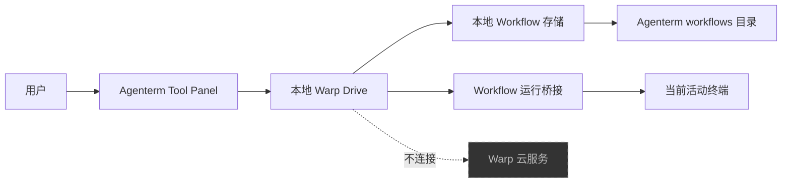

# Feature：仅含本地 Workflow 的 Warp Drive

**作者**：Agenterm Contributors  
**日期**：2026-09-11  
**状态**：Approved

---

## 1. 需求背景

### 1.1 问题与场景

Agenterm 当前提供本地终端、命令块和 SSH Warpify，但用户无法在应用内集中发现、管理并运行可复用命令。用户可以通过 Shell 自身或外部文件维护常用命令，但这些内容没有与 Agenterm 当前活动终端形成连续的查找、参数填写和运行体验。

目标用户是在本机终端及已进入的 SSH 会话中反复执行参数化命令的开发和运维人员。两个代表性场景是：

- 在当前活动终端中找到一个已保存的参数化命令，填写本次值后运行；
- 保存一条之后仍需重复使用的命令，并在后续 Agenterm 会话中再次找到它。

缺少应用内的 Workflow 使用路径，会让可复用命令与当前终端上下文割裂，使用户经常需要在终端与其他维护方式之间切换。

### 1.2 现状分析

当前 Agenterm 在 OSS 通道统一隐藏标题栏 Tool Panel 按钮；左侧面板的可用视图仍由上游设置动态计算，因此即使恢复按钮，也可能同时暴露 Project Explorer、Global Search 或 Agent conversations。

现有 Warp Drive 面板以云对象缓存为主要数据源。Workflow 的创建、更新和删除会进入云对象更新管理链路，并依赖账号空间、对象权限和同步状态。Agenterm 已跳过 OSS 登录流程，同时禁止 OSS 启动实时云对象监听，因此直接恢复现有 Warp Drive UI 只会得到账号门槛或无法完成保存的界面。

代码库同时保留了一条独立的本地 Workflow 路径：

- 本地配置模型会从应用数据目录下的 `workflows` 目录递归读取 YAML；
- 文件监视器会在 Workflow 文件变化后重新加载数据；
- 普通命令 Workflow 已支持名称、命令、说明、标签和文本参数；
- 已有终端输入链路可以展示 Workflow 参数并把展开后的命令送入活动终端；
- Agenterm 使用独立的数据目录，不与已安装的正版 Warp 共享配置。

Zap 提供了显式的 cloud-disabled 通道判断和本地 Drive 产品表达，可用于校验本任务的去云边界。但其当前 Drive 仍保留账号判断、云对象标识和更新管理路径，不能直接作为本地 Workflow 持久化实现移植。

## 2. 目标与非目标

### 2.1 目标

1. 在 Agenterm 中提供一个可发现、可开关的左侧工具面板，且该面板只有 Warp Drive。
2. 让用户在完全离线、未登录状态下管理并运行本地普通命令 Workflow。
3. 让本地 Workflow 在 Agenterm 重启后保持可用，并在外部文件发生变化时及时刷新。
4. 保持 Agenterm 现有终端、命令块、SSH Warpify 和独立数据目录行为不变。

### 2.2 非目标

- 不提供账号登录、注册或身份同步。
- 不提供云端同步、团队空间、分享、链接、版本历史或跨设备恢复。
- 不在 Warp Drive 中提供 Notebook、Environment Variables、AI Facts、MCP Server 或 Agent Mode Workflow。
- 不恢复 Project Explorer、Global Search、Agent conversations、AI 或 Agent Mode 工具面板。
- 不在本期提供依赖远端数据的枚举参数；本地 Workflow 参数限定为文本值。
- 不在应用内编辑或删除外部管理、多文档或包含额外格式信息的 Workflow YAML。
- 不导入、迁移或修改正版 Warp 的 Drive 数据。

## 3. 需求

### 3.1 功能性需求

1. 用户无需登录即可看到并打开 Tool Panel。
2. Tool Panel 只能显示 Warp Drive；不存在切换到其他工具视图的按钮或菜单项。
3. Warp Drive 只能列出 Agenterm 本地保存的普通命令 Workflow，不显示云空间或其他对象类型。
4. 用户可以按名称或命令内容过滤本地 Workflow。
5. 用户可以新建包含名称、命令、可选说明、标签和文本参数的 Workflow。
6. 用户可以修改或删除由 Agenterm 本地 Warp Drive 创建和管理的 Workflow。其他合法本地 Workflow 可以显示和运行，但必须明确标为外部管理且不可在面板内改写。
7. 保存成功后，列表必须反映最新内容；关闭并重新打开 Agenterm 后内容必须保持一致。
8. 用户在 Agenterm 之外合法修改本地 Workflow 文件后，面板必须重新加载有效内容；外部删除在文件事件收敛后必须移除对应条目。
9. 用户选择有效 Workflow 后，可以填写参数并将展开后的命令放入当前活动终端；由用户按现有终端交互决定是否执行。没有活动终端时，运行操作必须禁用并提示用户先打开终端，不得隐式创建或执行终端。
10. 当已加载且仍存在的文件后续暂时无法读取或解析时，应用必须继续显示该文件最后一次有效快照并标记错误；错误快照禁止运行、编辑和删除，文件恢复有效后恢复正常操作。首次扫描即失败的文件不生成 Workflow 条目，但必须显示文件错误。写入或删除失败时必须保留最后一个已确认成功的状态。
11. 打开或使用本地 Warp Drive 不得展示登录提示，也不得因账号状态拒绝操作。

### 3.2 非功能性需求

- **离线性**：本地 Warp Drive 的初始化、展示、空状态、CRUD、刷新、运行、冲突及所有错误路径均不得构造或调用账号、云监听、云 API、同步队列或网络 fallback。全应用已有的其他网络能力不属于本功能，但 Workflow 名称、命令正文和参数值不得进入遥测。
- **持久性**：只有本地文件完整写入成功后才能向用户报告保存成功；失败不得破坏最后一个有效版本。
- **响应性**：文件读取和写入不得阻塞 UI 线程；面板打开后必须先显示已有内存快照。本期不设绝对延迟 SLO，以 1,000 个 Workflow、YAML 总量 10 MiB 的测试数据验证后台 I/O 和快照渲染边界。
- **兼容性**：现有合法的本地普通命令 Workflow YAML 仍可被读取和运行，多文档 YAML 文件不得因本功能启用而失效。
- **隔离性**：本功能只能读写 Agenterm 自有数据目录，不得访问正版 Warp 的配置目录或数据库。
- **可访问性**：面板、列表、创建/编辑操作和错误状态必须具备键盘导航及可读的 accessibility 名称。

### 3.3 约束

- 用户明确要求本功能不登录、不包含线上逻辑。
- 必须继续使用 Agenterm 独立的应用标识和本地数据目录。
- 必须保持现有本地 Workflow YAML 的读取兼容性。
- 不得重新启用 Agenterm OSS 通道已关闭的云对象实时监听。

---

## 4. 设计方案

### 4.1 方案总览

Agenterm 为 Warp Drive 增加专用的本地模式。Workspace 在 Agenterm 通道只暴露 Warp Drive 这一种工具视图；Warp Drive 本地模式使用文件系统中的 Workflow 集合作为唯一数据源，并通过现有终端 Workflow 运行链路与活动终端连接。上游云端 Warp Drive 实现继续为其他通道保留，但 Agenterm 的入口不会构造或调用它。

### 4.2 前提与系统不变量

已确认前提：

- 本功能只服务 Agenterm 的原生本地文件系统构建。
- 用户接受本期只支持普通命令 Workflow 和文本参数。
- 用户要求数据仅保存在 Agenterm 本地，不需要跨设备同步。

系统级不变量：

- 本地 Workflow 的可用性与账号、网络和 Warp 服务端状态无关。
- 每次已报告成功的修改在应用重启后仍可读取。
- 任何本地 Workflow 操作都不能改变或启动云同步状态。
- Workflow 始终在用户当前活动终端中进入现有参数填写与命令输入流程，不创建隐藏终端执行。
- Agenterm 不读取或写入其他 Warp 产品的数据目录。

### 4.3 接口与协议

用户可见接口：

- 标题栏显示 Tool Panel 按钮；按钮 tooltip 在唯一视图场景下显示“Warp Drive”。
- Warp Drive 标题区域提供新建 Workflow 操作，列表项提供运行、编辑和删除操作。
- 空列表显示本地说明和新建入口，不显示在线文档、登录或团队引导。
- 删除操作需要用户确认；取消后不得改变文件或列表。

本地文件协议：

- 可发现的本地 Workflow 位于 Agenterm 数据目录的 `workflows` 子目录，继续采用现有 YAML 格式。
- Agenterm 管理的 Workflow 位于 `workflows/drive` 子目录；新建 Workflow 使用独立、稳定且不包含用户输入的文件名，避免名称冲突和路径注入。
- 每个新建文件只保存一个 YAML 文档；读取仍兼容一个文件包含多个 Workflow 文档的旧格式。
- `workflows/drive` 之外的文件，以及不符合受管单文档格式的文件，属于外部管理：可以显示和运行，但编辑与删除必须禁用。应用不得通过反序列化再序列化重写这些文件，因此保留其未知字段、注释、字段顺序和文本格式。

错误语义：

- 输入校验失败时保留编辑内容并指出字段问题。
- 受管文件在编辑期间发生应用已观察到的外部修改时，不覆盖新内容；提示用户重新加载后重试。
- 文件操作失败时保留当前内存快照和磁盘上的最后有效版本。

### 4.4 组件设计

- **Workspace 工具面板策略**：在 Agenterm 通道返回唯一的 Warp Drive 可用视图，并允许标题栏渲染 Tool Panel 按钮；其他通道维持现有动态视图策略。
- **本地 Workflow 存储模型**：拥有 Workflow 快照、来源文件、管理属性和内容版本；负责初始扫描、外部变更刷新、校验及受管文件 CRUD。它是 Agenterm 本地 Warp Drive 的唯一写入入口。
- **本地 Warp Drive 面板**：只消费本地存储模型，负责搜索、选择、空状态、创建/编辑/删除入口和键盘焦点，不依赖账号或云对象模型。
- **本地 Workflow 编辑器**：复用现有 Workflow 字段和文本参数交互，但保存目标为本地存储模型；不创建云对象标识、owner、folder 或同步任务。
- **Workflow 运行桥接**：把所选本地 Workflow 交给现有终端 Workflow 参数和输入链路；它不负责持久化，也不直接执行命令。
- **云端 Drive 组件**：保持现状供非 Agenterm 通道使用；Agenterm 本地模式与其数据源和事件分支隔离。

### 4.5 关键机制

#### 4.5.1 本地身份与文件映射

扫描每个 YAML 文件时，为每个有效文档建立包含来源路径、文档序号、管理属性和文件内容版本的本地记录。只有位于 `workflows/drive`、文件名符合 Agenterm 生成规则且内容恰好包含一个普通命令 Workflow 的记录属于受管对象。Agenterm 新建 Workflow 时生成随机稳定文件名并写入该目录。用户修改 Workflow 名称不会改变文件名或本地身份。

#### 4.5.2 安全写入

创建和修改先在受管目录写入临时文件，完成序列化和落盘后再原子替换目标文件。修改或删除前比较当前文件内容版本与编辑开始时记录的版本；不一致时拒绝覆盖并触发重新加载。删除只作用于受管单文档文件。比较只能拒绝保存前已经观察到的外部变化，不宣称能与未参与协调的外部 writer 实现强原子冲突检测。

机制不变量：

- 目标文件在成功替换前始终保留旧的完整内容；
- 任一文件操作最多产生旧版本或新版本，不能留下半个 YAML 文档；
- 临时文件不进入可见 Workflow 快照；
- 保存前已观察到的外部变更优先于过期的编辑提交。

#### 4.5.3 列表刷新

存储模型启动时异步扫描本地目录并发布快照。文件监视事件先短暂合并，再对目录状态生成一次刷新结果；外部编辑器以 rename 保存时，中间的删除/创建事件因此按最终目录状态处理。刷新结果携带单调递增的本地 generation，旧扫描结果不得覆盖较新的写入或刷新状态。

已加载且仍存在的文件后续读取或解析失败时，保留该文件最后有效的错误快照；错误快照禁止运行、编辑和删除。首次扫描失败的文件只产生错误。文件恢复有效后以新内容替换旧快照并清除错误。合并刷新后文件确定不存在时移除对应条目。面板订阅快照变化并保持当前选择在仍存在的本地身份上。

#### 4.5.4 运行

用户选择有效且非错误状态的 Workflow 后，面板发出本地 Workflow 事件。Workspace 将其路由到当前活动终端的既有 Workflow 交互：存在参数时先显示参数输入，无参数时把命令放入输入框。没有活动终端或条目处于错误快照状态时，面板禁用运行并显示原因。该路径不调用本地存储写入，也不创建后台执行。

## 5. 备选方案

### 直接恢复现有云端 Warp Drive

该方案 UI 改动最少，但保存和对象列表依赖账号空间、权限模型及云对象更新链路，与离线和无登录要求冲突。只有产品重新需要云同步时才应重新考虑。

### 把本地 Workflow 伪装成未同步云对象

该方案可以复用更多现有 Drive UI，但仍需要伪造 owner、对象标识和同步状态，容易意外进入网络队列，也会让本地错误被解释为同步错误。本期不采用。

### 只显示现有 Workflow 搜索弹窗

该方案可以快速提供运行能力，但无法完成创建、编辑、删除和持续可见的管理体验，也不满足恢复 Tool Panel 的目标。若未来只需要轻量命令启动器，可重新评估。

### 允许应用重写所有本地 YAML

该方案能让所有本地 Workflow 获得统一 CRUD，但序列化 round-trip 会丢失注释、自定义排版和无法识别的额外字段。除非未来引入能够完整保留 YAML concrete syntax 的编辑能力，否则外部管理文件保持只读。

### 使用 SQLite 建立新的本地 Workflow 表

SQLite 可以提供稳定标识和事务，但会与现有本地 Workflow YAML 形成两个事实来源，并削弱用户直接编辑文件的能力。除非未来 Workflow 数量或查询需求超出文件模型承载能力，否则不采用。

## 6. 横切关注点

### 6.1 兼容性、升级与回滚

现有 Workflow YAML 保持可读；本功能创建的单文档文件也能被原有本地 Workflow 加载器读取。旧多文档文件无需迁移，且不会被本地 Warp Drive 改写。

回滚到旧版 Agenterm 后，新建文件仍作为普通本地 Workflow 存在，只是 Tool Panel 入口消失。若新 UI 或存储写入出现破坏性问题，回滚触发条件是出现无法解析的新文件、旧文件内容丢失或非预期网络请求；回滚不需要数据迁移。

### 6.2 故障处理与恢复

- 初始目录不存在时视为空库，新建时按需创建。
- 已加载且仍存在的文件后续解析失败时保留其最后有效条目并标记为错误状态，同时禁用运行、编辑和删除；首次加载失败时只显示错误，不构造条目。
- 文件事件合并后确认文件已被外部删除时移除条目；rename-save 的短暂缺失按最终目录状态收敛。
- 写入、替换或删除失败时保持旧快照，允许用户修复权限或磁盘问题后重试。
- 应用在临时文件写入后崩溃时，下次启动忽略临时文件并继续读取原目标文件。
- 保存前检测到外部修改时以磁盘新版本为 authority，拒绝旧编辑覆盖。

### 6.3 并发与一致性

文件扫描和写入在后台执行，UI 模型只接收完整结果。针对同一受管文件的应用内修改串行化，文件监听事件与本应用写入事件合并后必须收敛到最终磁盘状态。未参与协调的外部 writer 在版本检查与原子替换之间仍存在极窄竞争窗口，该限制记录在 §8。终端模型锁不得跨文件 I/O 或 Workflow UI 更新持有。

### 6.4 性能与资源模型

设计按最多 1,000 个 Workflow、YAML 总量 10 MiB 的代表性规模验证；这是一项工程验收规模，不是线上容量承诺。初始扫描和刷新成本与 YAML 文件总大小线性相关。面板复用内存快照，打开面板不重复读取磁盘。受管 Workflow 的编辑只重写单个单文档文件。所有路径没有本功能引入的网络和云缓存资源成本。

### 6.5 可观测性与运维

本地日志需要区分扫描、解析、创建、更新、删除、冲突和运行路由，并记录可诊断的文件路径及错误类别；不得记录 Workflow 命令正文或参数值。面板应把用户可修复的问题转成可见错误，而不是只写日志。

### 6.6 安全性

Workflow 命令属于用户敏感数据，只保存在 Agenterm 本地目录，不进入遥测或网络请求。新建受管目录权限为当前用户专用，新建临时文件和最终文件权限为当前用户读写；原子替换不得放宽权限。生成的文件名不得包含 Workflow 名称等用户输入。所有路径必须规范化并限制在本地 Workflow 根目录内，拒绝目录穿越和符号链接逃逸。运行 Workflow 只填充当前终端输入，不绕过用户确认直接执行。删除仅针对已解析并仍位于受管根目录内的目标文件。

## 7. 测试计划

- **单元测试**：覆盖 Tool Panel 唯一视图策略、本地记录身份、单/多文档 YAML 读取、受管与外部文件分类、原子创建/更新/删除、外部修改冲突、非法路径和解析失败后的最后有效快照。
- **组件测试**：覆盖未登录状态下 Warp Drive 可用、空状态、新建/编辑/删除交互、键盘导航，以及云端/登录入口不可见。
- **运行链路测试**：覆盖无参数 Workflow、文本参数 Workflow、活动终端缺失和 SSH Warpified 终端场景，确认命令进入现有输入流程且不自动执行。
- **离线测试**：为云客户端安装失败即报错的测试替身，覆盖初始化、空状态、CRUD、刷新、运行、冲突和错误展示，证明没有网络调用或账号交互。
- **故障注入测试**：覆盖临时写入、落盘、原子替换和删除失败，遗留临时文件后的重启恢复，以及旧扫描结果不得覆盖新写入结果。
- **外部变更测试**：覆盖直接修改、外部删除、rename-save、暂时不可读、非法 YAML、错误快照禁止运行和修改，以及文件恢复有效后的状态恢复。
- **兼容性测试**：使用现有多文档 Workflow fixture，验证读取和运行；确认其编辑/删除禁用且未知字段、注释、字段顺序、文本格式和符号链接目标不被改写。
- **权限测试**：验证新建受管目录、临时文件和最终文件权限，并确认替换不会放宽权限。
- **规模测试**：用 1,000 个 Workflow、总量 10 MiB 的 fixture 验证文件 I/O 不在 UI 线程执行且面板先渲染内存快照。
- **可访问性测试**：验证 Tool Panel、列表、编辑操作、只读标记和错误状态具有稳定的 accessibility 名称。
- **GUI smoke test**：构建签名后的 Agenterm 中完成打开面板、创建、运行、编辑、重启恢复和删除，并检查日志中无登录或云请求。

## 8. 未决问题与风险

未决问题：无。用户已明确本期只需要本地普通命令 Workflow，不需要登录或云能力。

已知风险：

- **上游 Drive UI 与云模型耦合较深**。Detection：实现 diff 出现 owner、team、server ID、同步队列或账号判断进入 Agenterm 本地路径。Mitigation：使用独立本地面板和存储事件，在代码评审及离线测试中阻止这些依赖。
- **外部编辑可能与应用内编辑冲突**。Detection：保存前内容版本不一致。Mitigation：拒绝覆盖、刷新磁盘版本并保留用户尚未提交的编辑内容。
- **未协调外部 writer 存在极窄 TOCTOU 窗口**。Detection：该窗口无法被应用可靠自动检测，只能由用户观察到外部修改丢失或借助外部文件工具发现。Mitigation：只有应用受管目录中的单文档文件可编辑，界面提示不要并发外部编辑，版本检查与原子替换尽量缩短窗口；明确不提供跨进程强一致性或自动恢复。
- **外部或多文档 YAML 可能包含未知字段、注释和自定义格式**。Detection：文件不属于受管单文档目录或不符合受管格式。Mitigation：保持只读，只允许显示和运行，不通过应用改写。
- **本地文件权限可能意外暴露敏感命令**。Detection：权限测试和启动扫描发现受管目录或文件权限宽于当前用户。Mitigation：创建与替换时收紧为当前用户专用权限，并显示无法修复时的错误。
- **Workflow 可能包含危险命令**。Detection：运行链路测试确保参数展开后的完整命令始终出现在当前终端输入框，并检测任何绕过输入框直接执行的路径。Mitigation：不自动执行，由用户在可见终端中确认。

## 9. 参考资料

- Agenterm 当前任务计划：`.agent/warp-drive-only-tool-panel/plan.md`
- Agenterm Tool Panel 与左侧面板：`app/src/workspace/view.rs`、`app/src/workspace/view/left_panel.rs`
- Agenterm 云端 Warp Drive：`app/src/drive/panel.rs`、`app/src/drive/index.rs`、`app/src/server/cloud_objects/update_manager.rs`
- Agenterm 本地 Workflow 加载与监听：`app/src/user_config/native.rs`、`app/src/user_config/util.rs`、`app/src/workflows/local_workflows.rs`
- Agenterm Workflow 参数与运行：`app/src/workflows/categories.rs`、`app/src/workflows/info_box.rs`、`app/src/terminal/input.rs`
- Agenterm 多文档兼容 fixture：`crates/integration/tests/data/test_workflow.yaml`
- Zap cloud-disabled 边界：`/Users/nickhaoxu/my-stdio/zap/crates/warp_core/src/channel/state.rs`
- Zap Drive 本地产品表达：`/Users/nickhaoxu/my-stdio/zap/app/src/settings_view/warp_drive_page.rs`
- Zap 云端剥离记录：`/Users/nickhaoxu/my-stdio/zap/CHANGELOG.md`
